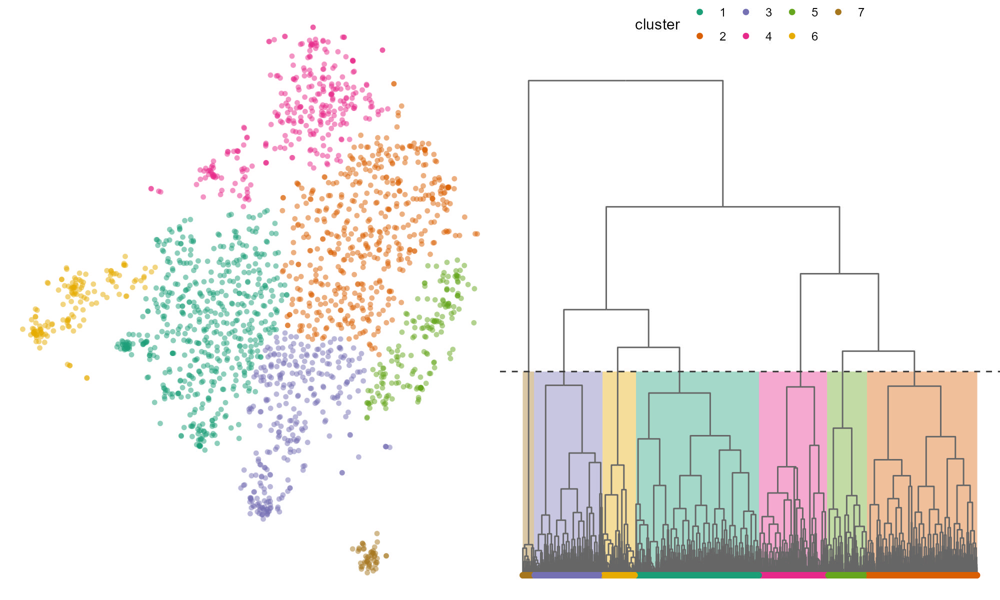
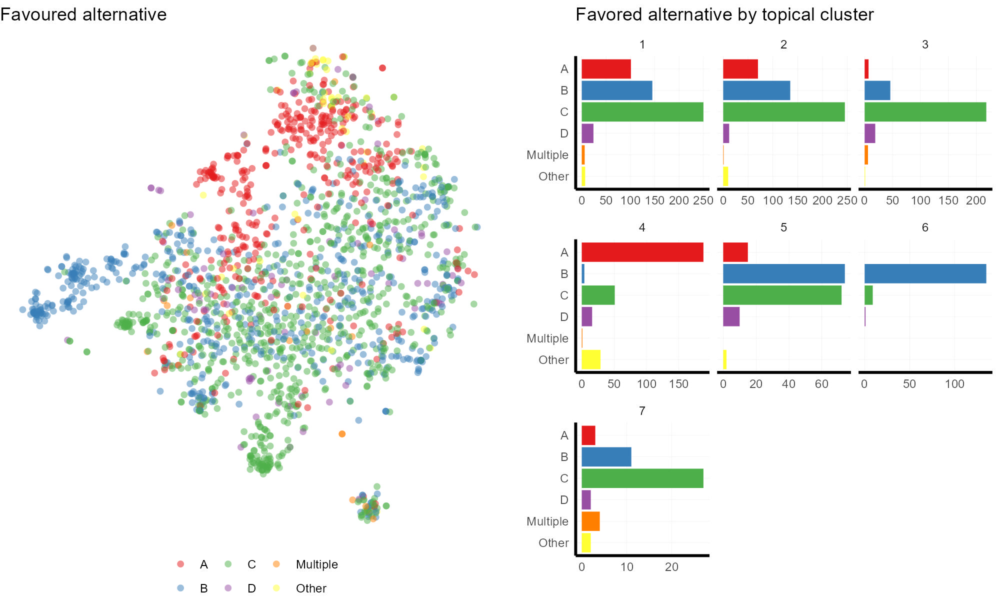

# Text analaysis of Isle Royale EIS public comments via AI tools

In this project, I explored using chatGPT, text embeddings, and Claude2 to analyze public comments on a complex environmental management decision. I demo methods to responsibly validate output classifications from LLMs. While not perfect, chatGPT showed promising reliability at categorizing free-form opinions. The text embeddings uncovered hidden topical clusters among comments that traditional methods would have missed. Claude2’s long context window allowed for further interpretation of the topical clusters. Together, these tools enabled a nuanced quantitative analysis of subjective text data that would be infeasible for a single human analyst to perform manually.

### Please view my [blog post](https://www.azandisresearch.com/2023/10/05/text-analysis-using-ai-in-r/) detailing this project which walks through the analysis and it's implications.

